<h1 align="center">Daveedus</h1>

<p align="center">A workout tracker that lives in your browser. No account, no ads, no server - your data stays on your phone.</p>

<p align="center"><a href="https://quicasha.github.io/daveedus/"><strong>Open the app</strong></a></p>

<p align="center">
  <a href="https://github.com/Quicasha/daveedus/actions/workflows/test.yml"></a>
  <a href="LICENSE"></a>
  
  
</p>

<details>
<summary><b>See it in action</b> - every tab, live</summary>
<br>
<table>
  <tr>
    <td align="center">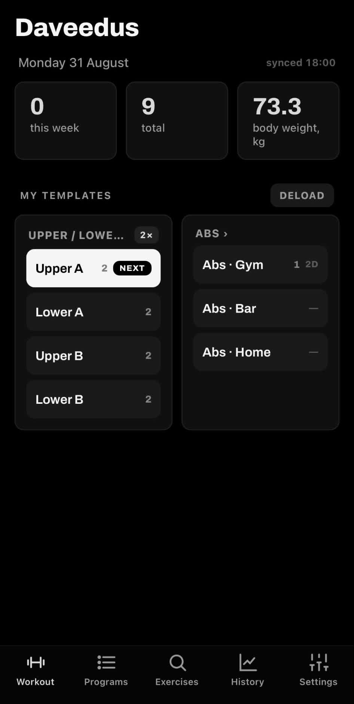<br><sub><b>Home</b></sub></td>
    <td align="center">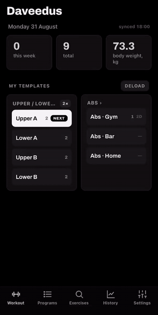<br><sub><b>Workout</b></sub></td>
    <td align="center">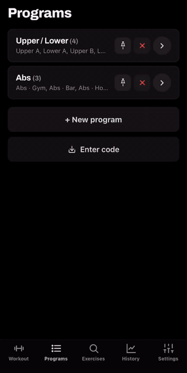<br><sub><b>Programs</b></sub></td>
  </tr>
  <tr>
    <td align="center">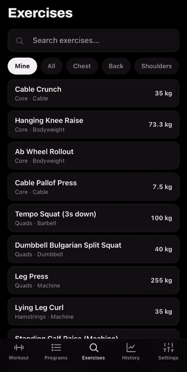<br><sub><b>Exercises</b></sub></td>
    <td align="center">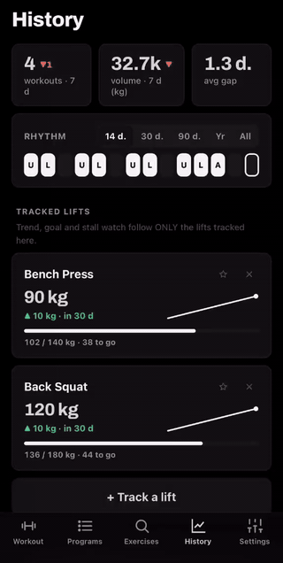<br><sub><b>History</b></sub></td>
    <td align="center">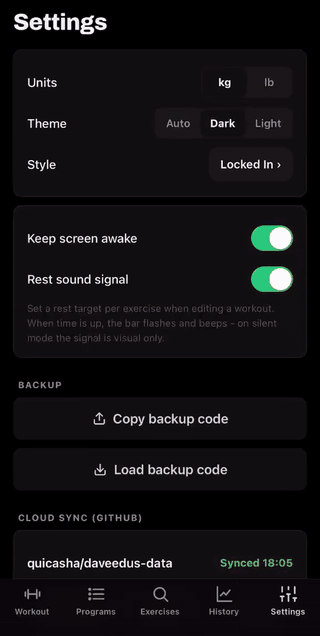<br><sub><b>Settings</b></sub></td>
  </tr>
</table>
<p align="center"><sub><b>The details</b> - what the training brain does</sub></p>
<table>
  <tr>
    <td align="center">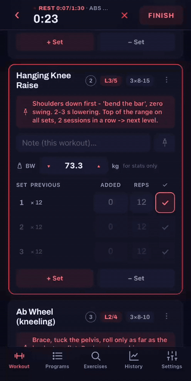<br><sub><b>Progression ladder</b></sub></td>
    <td align="center">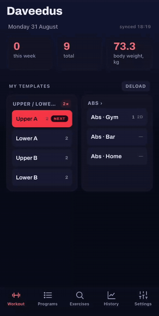<br><sub><b>Deload</b></sub></td>
    <td align="center">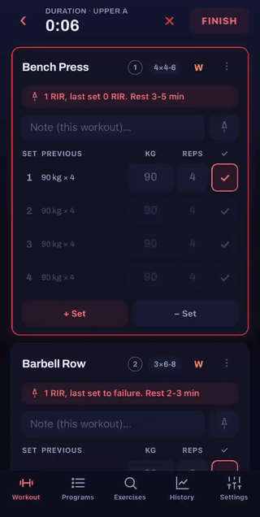<br><sub><b>Wave mode</b></sub></td>
  </tr>
  <tr>
    <td align="center">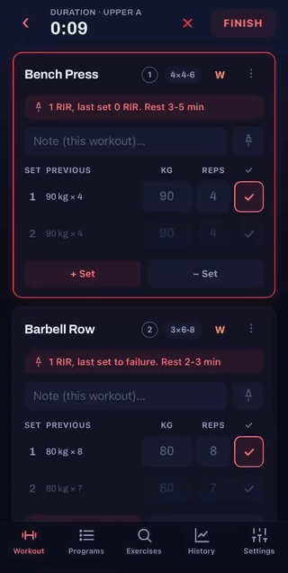<br><sub><b>Superset</b></sub></td>
    <td align="center">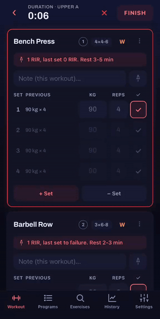<br><sub><b>Swap exercise</b></sub></td>
    <td align="center">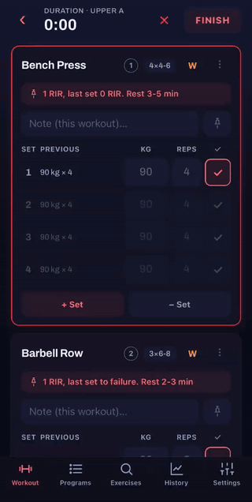<br><sub><b>Warmup ramp</b></sub></td>
  </tr>
</table>
</details>

---

## Install

- **iPhone** - open the link in Safari → **Share** → **Add to Home Screen**
- **Android** - open it in Chrome → **⋮** → **Install app**

Takes half a minute. After that it runs full-screen and works fully offline.

## What it does

- Logs sets fast - last session's numbers are the placeholders, one tap confirms, the rest clock starts itself. Green or red judges the session so far, never one set against one set: push the first set heavier and a shorter second set stays green, because you are ahead
- Programs with alternatives per exercise - bench taken, swap in one tap; each variant keeps its own history
- Progression runs quietly in the background - rep-range hints, a 4-week wave for stalled lifts, deloads, eased-in suggestions after a break
- Level ladders for bodyweight work - L1→L5 progressions (knee raise → toes-to-bar); two clean sessions at the top of the range and the next level loads itself
- Rotation programs suggest what's NEXT; free-pick splits (gym / bar / home) skip rotation and deload, showing how often and how long ago instead
- Records and charts - estimated 1RM trends, rep records, tracked lifts with goals and projections
- Max tests when you feel like one - "Test a max" on any lift, in the middle of a workout or on its own: warm-up to the opener, three suggested attempts from what the lift shows now, each one made or missed with its time. Every attempt stays on the exercise screen, a made single counts as a record even on a deload day, and the test never distorts your training trends
- Progress per workout, not just per exercise - open any workout to see its own volume trend, cadence and every lift measured inside that workout alone, so a bench climbing in Upper A cannot hide one stalling in Upper B
- Programs side by side - once a second program has sessions, compare blocks on length, cadence, volume and every shared lift's change per week, so a 6-week block and a 20-week one answer the same question
- Weekly sets per muscle - four weeks side by side against the 10-20 set research band, so the back never quietly falls behind the chest
- The gym details covered: one-tap warm-ups that load the bar the way you do and taper the way the evidence says (empty bar, then big plates only, the last set a short one at or under 90% - 20 / 60 / 80 / 90 on the way to 100, 20 / 60 / 80 / 100 / 120 on the way to 140, 45 / 135 / 165 / 195 on the way to 225 lb), drop sets, supersets, rest timers, machine base weight, bodyweight exercises, kg / lb
- Share a program as a short code

## Your data

Everything is stored on the device, in two places at once - if one breaks, the app restores from the other.

- **Backup code** - copy it once in a while and keep it somewhere safe; it's the one thing that survives a lost phone
- **Cloud sync** (optional) - every finished workout is pushed to your own private GitHub repo automatically. Your repo, your token; without it nothing ever leaves the device. On a new phone, connect and tap **Restore from cloud** - everything comes back. A device that has never synced never replaces a backup that is already there without asking, and the repo only gets a commit when your data actually changed
- **CSV export** - tidy per-set data for Excel or anything else

Updates install themselves the next time you open the app.

---

## Under the hood

Plain HTML, CSS and vanilla JavaScript - no frameworks, no build step, no dependencies. State lives in `localStorage`, mirrored to `IndexedDB` as a safety net: writes are debounced and flushed when the app is backgrounded, on launch the newer of the two copies wins, and a copy that loses is parked rather than destroyed. A service worker makes the app offline-first and self-updating.

The code is split into small per-domain scripts, loaded in dependency order (everything is global by design - inline handlers resolve against global scope):

```
index.html              App shell + script load order
css/style.css           Styles: seven themes, each with dark and light palettes
js/exercises.js         Built-in exercise database (ids are permanent)
js/i18n.js              App version + every user-facing string
js/util.js              Formatting, volume formula, toast, skin registry + theme
js/state.js             The S state object: schema, validation, persistence, units
js/ui.js                Render core: navigation, topbar, tab bar, modal
js/home.js              Home screen (week plan, reminders, program cards)
js/deload.js            Deload cycle, options sheet, passive deload advisor
js/workout.js           The active session: logging, ghosts, wave, comeback easing, finish
js/program.js           Programs and the template editor
js/exercises-ui.js      Exercise picker, browser, custom form, detail view
js/stats.js             e1RM trends, tracked lifts, PR feed, rhythm views, charts
js/history.js           History list, search, editing, body weight, plate calculator
js/settings.js          Settings screen
js/data.js              Share/backup codes, import, CSV, GitHub cloud sync
js/boot.js              Startup, rest signal, wake lock, onboarding
test/                   node:test suite for the training brain (no DOM, no deps)
sw.js                   Service worker (offline cache + auto-update)
manifest.webmanifest    PWA manifest
icons/                  App icons
serve.ps1               Zero-dependency local dev server (PowerShell)
```

Weights are stored in kilograms and converted only for display, so switching units is lossless. Share and backup codes are Base64-encoded JSON with a `DVD1.` prefix. Cloud sync PUTs a JSON snapshot to a GitHub repo through the Contents API - the token never leaves the device and is never included in backup codes.

**Tests** - `node --test` (Node 20+, nothing to install). A vm harness loads the plain script files with a stubbed browser and exercises the training brain: progression ladders, waves, deloads, e1RM, unit conversion, share-code roundtrips, cloud-sync bookkeeping, and the finish / continue / finish bookkeeping around a session. CI runs the suite on every push.

**Why the numbers are what they are** - every rule the training brain runs on is traced to its evidence, with the caveats and the exact thresholds, in two documents:

- [`docs/RESEARCH-TRAINING.md`](docs/RESEARCH-TRAINING.md) - volume, effort, frequency, rest, estimated 1RM and its noise floor, waves, deloads, layoffs, warm-ups, ladders: what the studies show, for whom, and where each finding lands in the code
- [`docs/RESEARCH-APP.md`](docs/RESEARCH-APP.md) - why people stop logging, what feedback does to motivation, what a set row must get right, and what is deliberately left out (streaks, points, per-set effort ratings)

**Run locally** - any static file server: `powershell -File serve.ps1`, then open `http://localhost:8317`.

**Deploy** - push to `main`; GitHub Actions publishes to Pages. Bump `APP_VER` in `js/i18n.js` and `CACHE` in `sw.js` on every release so installed devices pick up the new files.

## License

[MIT](LICENSE) - use it, fork it, ship it. Attribution is appreciated, an issue with feedback even more so.
