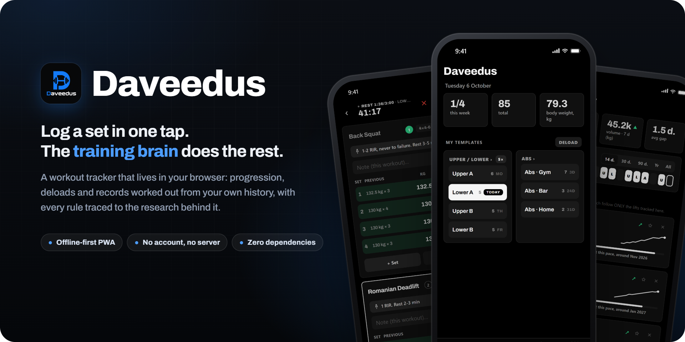
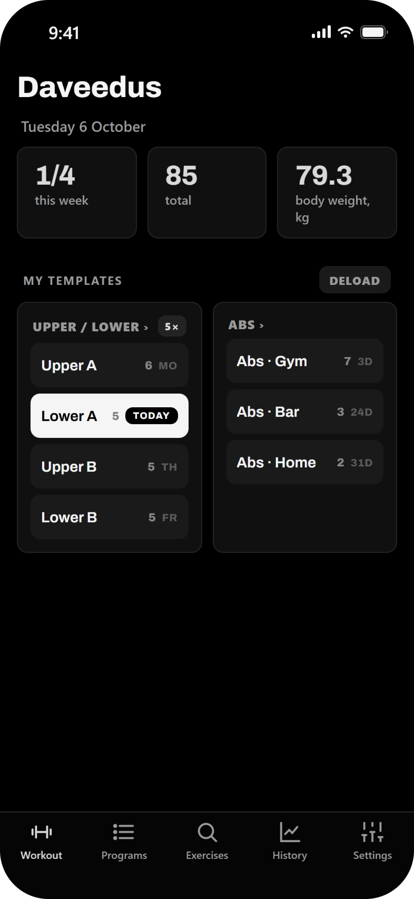
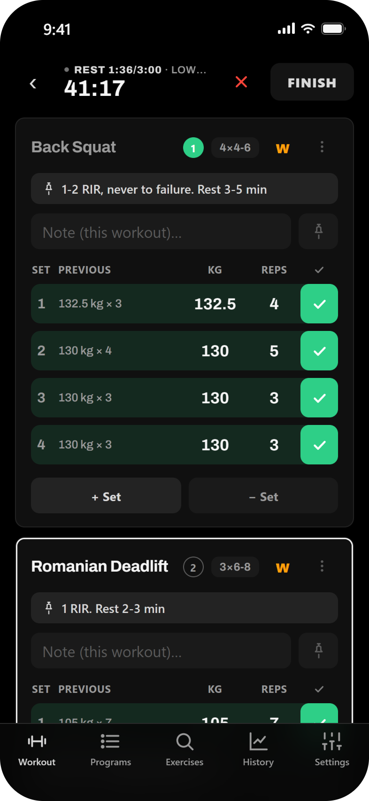
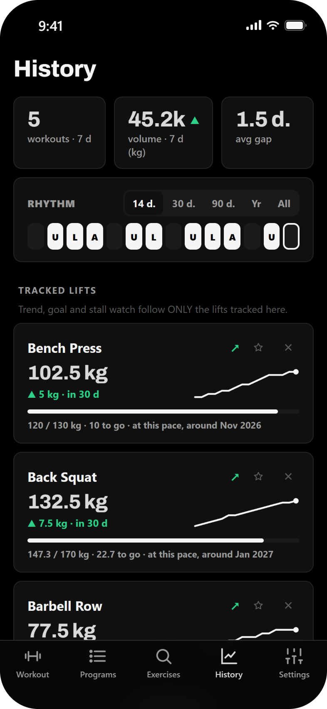
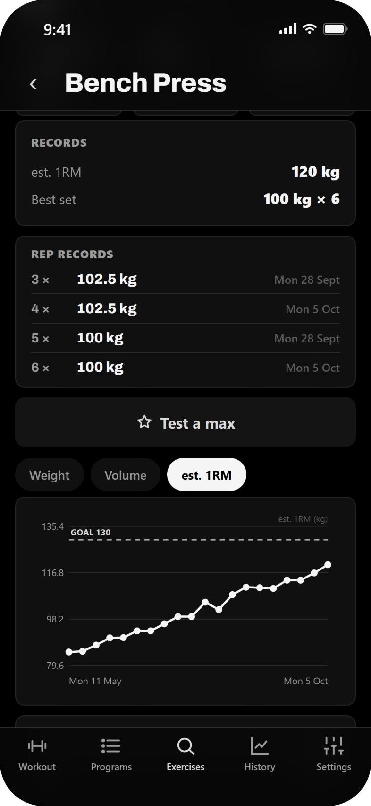
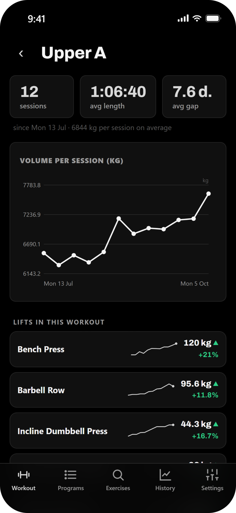
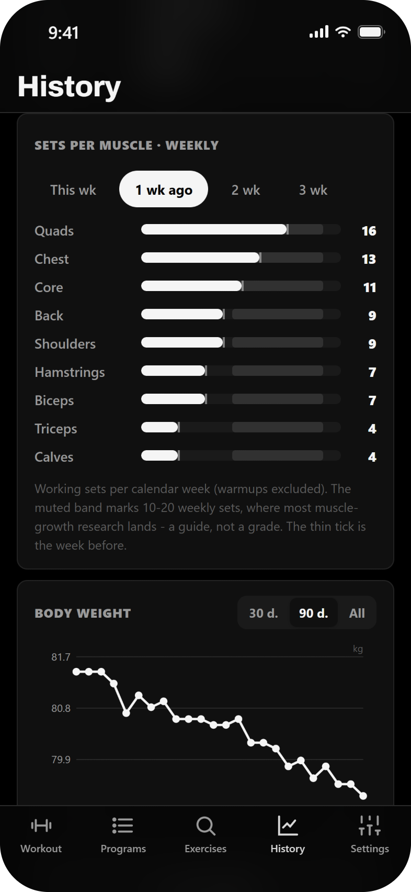
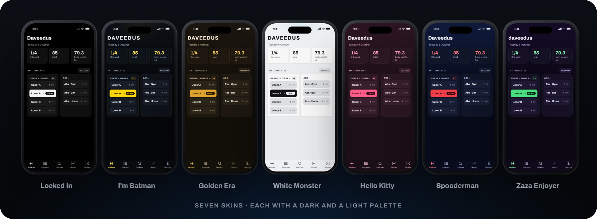

<p align="center">
  <a href="https://dovjonikas.github.io/daveedus/"></a>
</p>

<p align="center">
  <a href="https://dovjonikas.github.io/daveedus/"><b>Open the app</b></a>
  &nbsp;·&nbsp; <a href="#install">Install</a>
  &nbsp;·&nbsp; <a href="#features">Features</a>
  &nbsp;·&nbsp; <a href="#research">Research</a>
  &nbsp;·&nbsp; <a href="#tech">Tech</a>
</p>

<p align="center">
  <a href="https://github.com/dovjonikas/daveedus/actions/workflows/test.yml"></a>
  <a href="LICENSE"></a>
  
  
  
</p>

Daveedus is a workout tracker that runs in the browser. You add it to your home screen, it works offline, and all your data stays on the phone. There is no account and no server.

Logging is made for the gym. Your numbers from last time are already filled in, so most sets take one tap. The app also handles progression from your history: double progression, a 4-week wave when a lift stalls, deload suggestions, lighter weights after a break, and trend lines that ignore normal day-to-day ups and downs. The reasoning and sources behind each rule are in [docs/RESEARCH-TRAINING.md](docs/RESEARCH-TRAINING.md).

<table>
  <tr>
    <td align="center" width="33%"><br><b>Home</b><br><sub>Today's workout and the week's plan</sub></td>
    <td align="center" width="33%"><br><b>Workout</b><br><sub>Last session prefilled, rest timer in the top bar</sub></td>
    <td align="center" width="33%"><br><b>History</b><br><sub>Training rhythm, tracked lifts and goals</sub></td>
  </tr>
  <tr>
    <td align="center"><br><b>Exercise</b><br><sub>Records and estimated 1RM against the goal</sub></td>
    <td align="center"><br><b>Workout progress</b><br><sub>Volume per session and each lift in it</sub></td>
    <td align="center"><br><b>Weekly sets</b><br><sub>Sets per muscle against the 10-20 range</sub></td>
  </tr>
</table>

<p align="center"></p>

## Install

- **iPhone:** open [the app](https://dovjonikas.github.io/daveedus/) in Safari → Share → Add to Home Screen
- **Android:** open it in Chrome → ⋮ → Install app

After that it runs full screen, works offline and updates itself.

## Features

### Logging

- Last session's weights and reps are prefilled. Tap to confirm a set and the rest timer starts.
- A set turns green or red by comparing the whole session so far with last time, not one set against another.
- Warm-up sets in one tap, e.g. 20 / 60 / 80 / 100 / 120 kg on the way to 140.
- Drop sets, supersets, plate calculator, machine starting weight, bodyweight exercises, dumbbell pairs, kg or lb.
- Alternative exercises for each slot, each with its own history.
- Max tests with suggested attempts. A made single counts as a record and doesn't affect training trends.

### Progress

- Estimated 1RM trend for each lift, with a margin so normal session-to-session noise isn't read as a trend.
- Tracked lifts with goals. A projected date is shown only when the trend is actually going up.
- Stall detection, with an optional 4-week wave to get a lift moving again.
- Deload suggestions based on performance and weeks of training, or a fixed reminder every 6, 7 or 8 weeks.
- Lower suggested weights after a break, building back up over a few sessions.
- Progress per workout and weekly sets per muscle.
- When you start a new program, trends and stall checks start fresh for it.

### Programs

- Rotation programs show which workout is next; a weekday plan marks today's.
- Free-pick splits for training in different places (gym / bar / home).
- Level ladders for bodyweight exercises, e.g. knee raise up to toes-to-bar.
- Compare programs side by side.
- Archive old programs and reorder the rest.
- Share a program as a short code.

## Your data

Everything is saved on the device twice (localStorage and IndexedDB), so if one copy breaks the other restores it.

- **Backup code:** copy it now and then and keep it somewhere safe.
- **Cloud sync (optional):** saves to your own private GitHub repository after each workout. On a new phone, connect and tap Restore from cloud. Without it, nothing leaves the device.
- **CSV export** of every set, for Excel or anything else.

## Research

Where possible the numbers come from studies and coach surveys. Where the evidence is weak or missing, the docs say so.

- [docs/RESEARCH-TRAINING.md](docs/RESEARCH-TRAINING.md): volume, effort, frequency, rest, rep ranges, estimated 1RM, trends, waves, deloads, breaks, warm-ups, ladders.
- [docs/RESEARCH-APP.md](docs/RESEARCH-APP.md): why people stop logging, feedback and motivation, and what was left out on purpose (streaks, points, per-set effort ratings).

## Tech

| | |
|---|---|
| **Stack** | HTML, CSS and plain JavaScript. No framework, no build step, no dependencies |
| **Storage** | `localStorage` with an `IndexedDB` mirror; on launch the newer copy is used |
| **Offline** | Service worker that caches each release and updates on the next launch |
| **Units** | Stored in kg, converted only for display |
| **Sync** | Optional, to the user's own GitHub repo via the Contents API. The token stays on the device |
| **Tests** | `node:test` suite that loads the app scripts in a sandbox; runs in CI on every push |

<details>
<summary><b>Project structure</b></summary>

```
index.html              App shell and script load order
css/style.css           Styles: seven skins, each with a dark and a light palette
js/exercises.js         Built-in exercise database
js/i18n.js              App version and all UI strings
js/util.js              Formatting, volume and 1RM formulas, toasts, skins
js/state.js             State: schema, validation, saving, units
js/ui.js                Navigation, top bar, tab bar, sheets, icons
js/home.js              Home screen
js/deload.js            Deloads and the deload advisor
js/workout.js           The active workout: logging, warm-ups, waves, finishing
js/program.js           Programs, archive, order, workout editor
js/exercises-ui.js      Exercise picker, browser, detail view, charts
js/stats.js             1RM trends, tracked lifts, records, comparisons
js/history.js           History, body weight, plate calculator
js/settings.js          Settings
js/data.js              Share and backup codes, CSV, cloud sync
js/boot.js              Startup and onboarding
test/                   Tests and the sandbox harness
docs/                   Research notes
sw.js                   Service worker
manifest.webmanifest    PWA manifest
serve.ps1               Local dev server (PowerShell)
```

</details>

**Run locally:** any static file server works. On Windows: `powershell -File serve.ps1`, then open `http://localhost:8317`.

**Tests:** `npm test` (Node 20+).

**Release:** bump `APP_VER` in `js/i18n.js` and `CACHE` in `sw.js`, then push to `main`. GitHub Actions runs the tests and deploys to Pages.

## License

[MIT](LICENSE)
